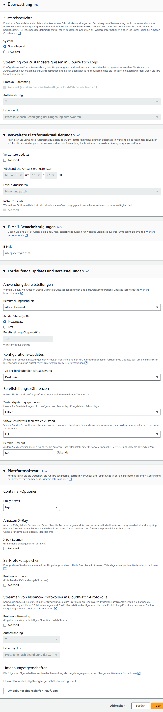
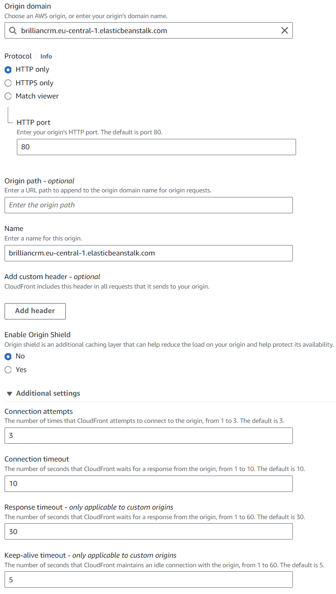
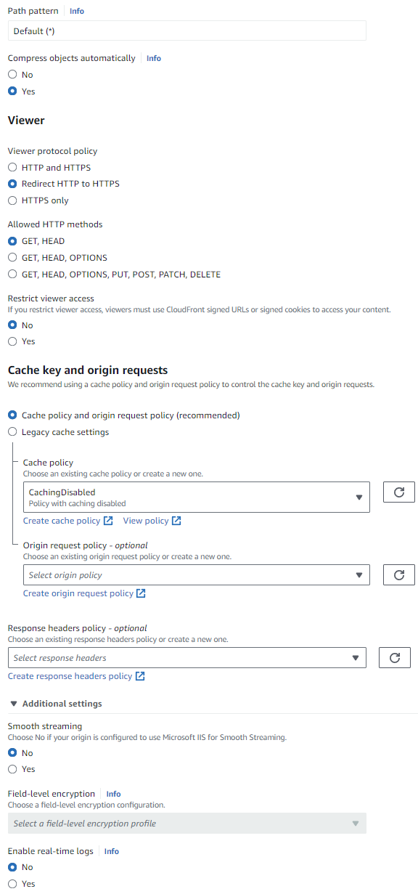
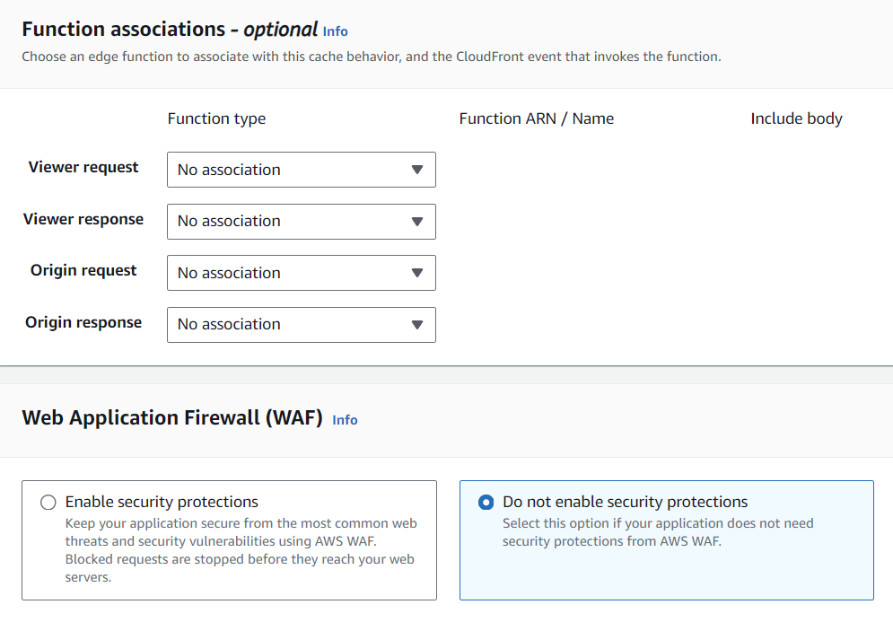
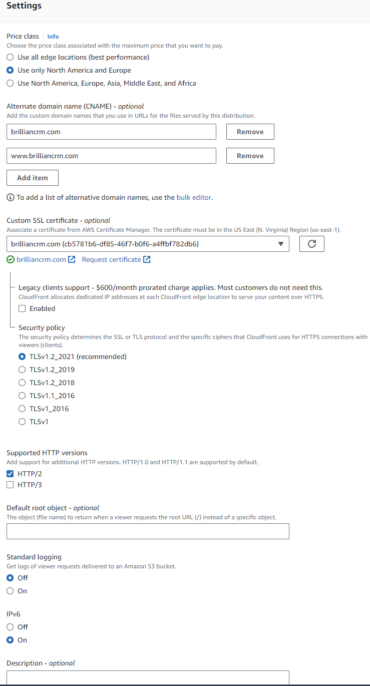
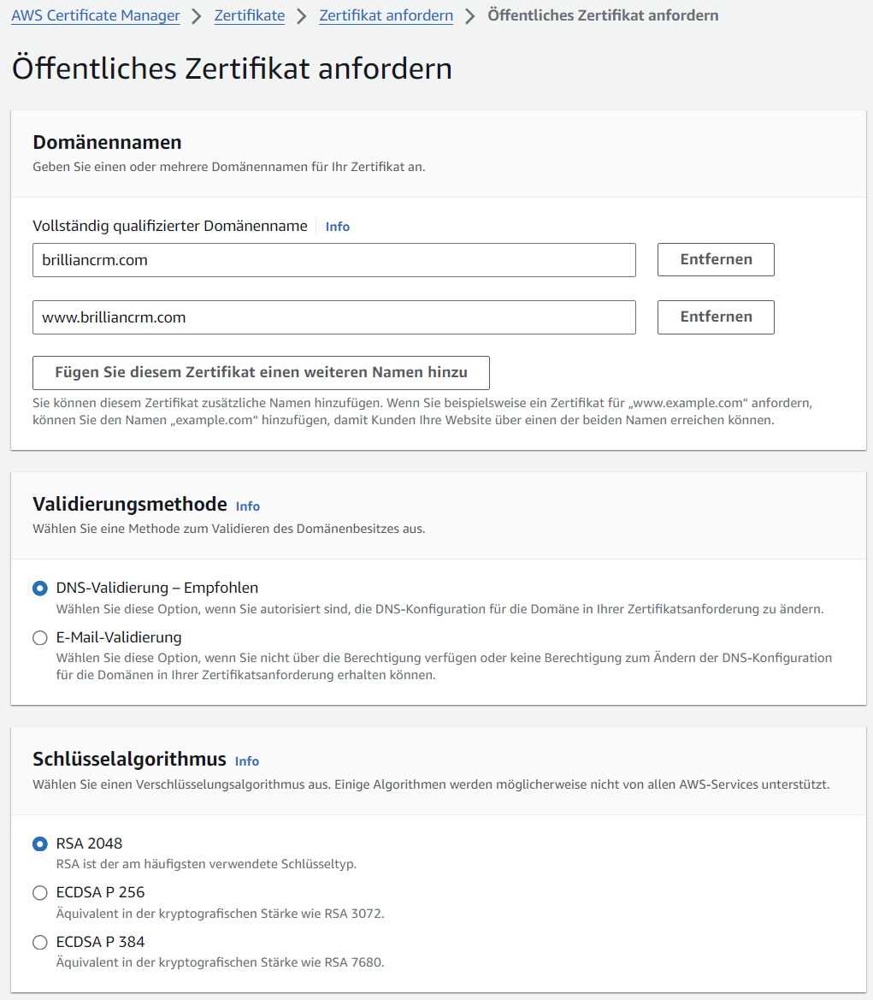

## Creating an Elastic Beanstalk Application

Most applications are deployed using Elastic Beanstalk and made available through Cloudfront. You must first create an application in the Elastic Beanstalk console, and then create an environment within that application, which is configured as follows:

### Step 1: Konfigurieren der Umgebung

1. Select a name for the application (`BrillianCRM`) and environment (`BrillianCRM-env`), then select the Elastic Beanstalk domain (`brilliancrm.eu-central-1.elasticbeanstalk.com`), which is later required for the integration with AWS CloudFront. The application and environment name must match the one defined in the `deploy-AWS.yml` [GitHub workflow](deployment).
2. Set the platform to Docker and leave the other platform options at default.
3. Select `sample application` for the initial deployment. The actual code will be automatically uploaded later via GitHub. Note that after deployment, it is also possible to manually upload a `docker-compose.yml` file directly from the AWS Beanstalk GUI.
4. Pick `Single-Instance (kostenloses Kontingent verfügbar)`.

  
Screenshot: Step 1

  

   
  

### Step 2: Konfigurieren des Servicezugriffs

1. Pick `Verwenden einer vorhandenen Servicerolle`.
2. Service role: `aws-elasticbeanstalk-service-role`.
3. EC2 SSH key pair: `IMBIT-SSH`.
4. EC2 instance profile: `aws-elasticbeanstalk-ec2-role`.

  
Screenshot: Step 2

  

   
  

### Step 3: Einrichten von Netzwerk, Datenbank und Tags

1. Select `IMBIT-VPC` for the VPC.
2. Do not assign a public IP, but add the application to its own subnet. Please give each application its own subnet, as they should all get their own subnet for proper security! [Read more about AWS Networking](domain#networking-setup).
3. No associated databases and tags are configured.

  
Screenshot: Step 3

  

   
  

### Step 4: Konfigurieren des Instance-Datenverkehrs und der Skalierung

1. Keep the default settings for the volume `Container-Standard`, CloudWatch interval `5 minute` and IMDSv1.
2. Add the EC2 security group `IMBIT-SecurityGroup`.
3. Our applications are not configured to scale, leave the default `Einzelne Instance` and `On-Demand-Instance` setting.
4. In terms of architecture, `ARM64` can be chosen for cost efficiency, but compatibility with the code base should be checked (only the `BrillianIdeas` application is known to work with `ARM64`).
5. The smallest instance with 1 GB RAM should suffice, as of 2024 that would be for ARM64 `t4g.micro` and for x86_64 `t3.micro`. [More on AWS Instances](https://aws.amazon.com/ec2/instance-types/).

  
Screenshot: Step 4

  

   
  

### Step 5: Konfigurieren von Updates, Überwachung und Protokollierung
1. Set Health reporting to basic.
2. Disable automatic updating, as it has crashed in the past. However, it may be worthwhile to re-evaluate and test automatic updates in the future.
3. Leave all other settings at default.

  
Screenshot: Step 5

  

   
  

### Step 6: Prüfen
1. Review the summary for errors and apply.
2. After about 5 minutes, the application will be accessible via its Elastic Beanstalk URL and it should show the AWS sample application.
3. Now you can update the application using the GitHub workflow.

## CloudFront as a Reverse Proxy

AWS CloudFront acts as a reverse proxy, and per Beanstalk application one CloudFront deployment is required.

### Origin Settings
1. The origin domain is configured using the URL of the Elastic Beanstalk application (`http://brilliancrm.eu-central-1.elasticbeanstalk.com`).
2. Set the protocol to `HTTP only` and on port `80`. Elastic Beanstalk applications will only have this port and protocol open.
3. Origin path is left empty, but adjust it if your application requieres it.
4. The Origin name is set to the name of the application (`BrillianCRM`).
5. Leave the other origin settings as default.

  
Screenshot: Origin Settings

  

   
  

### Default Cache Behavior
1. Leave most settings at their default values, unless otherwise noted here. See the Screenshot below for more details.
2. Select `Redirect HTTP to HTTPS` for the Viewer protocol policy.
3. Standard HTTP methods (`GET, HEAD`) usually work, however BrillianCRM, ICM and QUIZ require `GET, HEAD, OPTIONS, PUT, POST, PATCH, DELETE` for user login to work.
4. Caching policy `CachingDisabled` is chosen as otherwise it takes some time for changes to go live.

  
Screenshot: Default Cache Behavior

  

   
  

### Function associations and Web Application Firewall (WAF)
1. No function associations are created.
2. Disable the WAF to save costs.

  
Screenshot: Function associations and Web Application Firewall (WAF)

  

   
  

### Settings
1. Select for the Price class `Use only North America and Europe` to reduce costs.
2. To enable CloudFront to respond to requests for custom domains, such as `brilliancrm.com`, alternative domain names need to be entered.
    1. Press `Add item` for each entry.
    2. Enter the base URL (`brilliancrm.com`).
    3. Add the base URL with the www-prefix (`www.brilliancrm.com`).
3. Leave the other settings at their default values.

  
Screenshot: Settings

  

   
  

4. CloudFront automatically provides HTTPS if custom domain SSL certificates are selected. Please select the appropriate certificate. The certificates can be requested in AWS ACM (Certificate Manager) [North Virginia region!].
    1. When setting up SSL certificates with AWS ACM, the domain name and its `www` subdomain must be included in the request.
        

        
Screenshot: Certificate Request

        

        
        

        

    2. Validation is performed using CNAME records. The records must be created by clicking on the Certificate ID and clicking the `Erstellen von Datensätzen in Route 53` button.
        

        
Screenshot: Create DNS Records for certificate validation

        

        
        

        

### Activating the CloudFront Distribution
1. It takes some time to deploy the CloudFront distribution, once done the distribution gets a CloudFront URL (`d3afk01lmot4so.cloudfront.net`).
2. In Route 53, select the domain and create a new DNS record.
3. Enable the `Alias` toggle and leave the DNS type as `A`.
4. Select `Alias to CloudFront distribution`, paste in the field below the CloudFront URL and create the DNS record.
5. Allow some time for the DNS changes to propagate and you are done.

  
Screenshot: DNS Record Creation

  

   
  

## Stop or Remove an Application

:::danger Potential Data Loss
Before stopping an application, please be aware of the [data loss potential](data#data-loss-potential).
:::

- Applications can be stopped and removed from the Elastic Beanstalk dashboard. The status of the application will update to `beendet` and will be automatically removed by AWS after a period of time.
- To remove a Cloudfront distribution, you must first stop it, wait, and then you can remove it.
- Don't forget to remove the DNS records in Route 53 and delete the certificates in ACM.