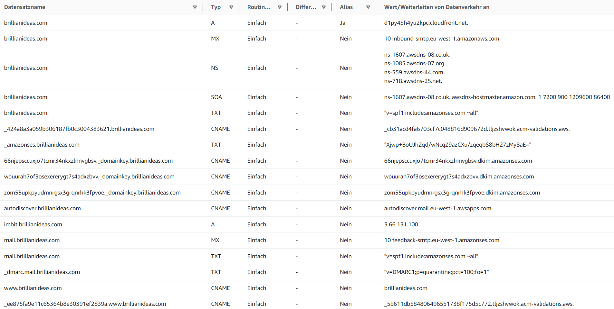

## Domains and DNS Settings
Managing domains and DNS settings involves:

- **Registration and Renewal**: Domains are registered and renewed directly through AWS and can be managed in Route 53.
- **DNS Setup**: DNS entries include a 'www' CNAME record that points to the root domain's A record, NS and SOA records pointing to AWS, and specific CNAMES for ACM validation. The A record links to the CloudFront alias URL.
- **Email-Configured Domain**: 'brillianideas.com' is configured with MX records for mail routing, SPF records for sender policy, DMARC for domain-based message authentication, and DKIM for email security, using CNAME records for DKIM verification. All domains are correctly set up with the exception of 'digital-learning-imbit.com.'

Route 53 DNS settings for brillianideas.com

## Networking Setup (in VPC Dashboard)
The VPC for IMBIT features:

- A default IP range (10.0.0.0/16).
- Private subnets for each application, starting at 10.0.41.0/24.
- Public subnets (10.0.0.0/20 and 10.0.16.0/20) for allowing external access.

IMBIT-VPC Oerview