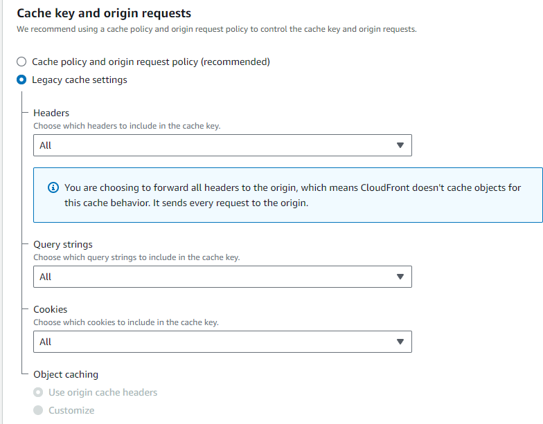

BrillianICM shares its origins with BrillianCRM, both emerging from the same initial codebase in 2011. However, it's important to recognize that BrillianCRM, being the newer system, has undergone more frequent updates in recent years. Consequently, BrillianICM's functionality hasn't been revisited for an extended period.

:::note Differences Overview
This page only outlines the distinct features and configurations of BrillianICM that set it apart from BrillianCRM. For more information on the shared features, please refer to the [BrillianCRM documentation](/projects/brilliancrm).
:::

## Quick Sheet
| Name      | URL           | Repository                  | Tech Stack | Database | CPU Platform | Hosting Location    |
|-----------|---------------|----------------------------|------------|----------|--------------|------------|
| BrillianICM | https://brillianicm.com | https://github.com/imbit-mannheim/brillianicm | Tomcat 9, JRE 21, Maven 3, Shiro Web 1.13.0 and other plugins found in `pom.xml` | MariaDB 11.5.0 | x86         | AWS |
  
## Enhanced Java Classes
BrillianICM extends its functionality with additional Java classes not found in BrillianCRM:

- `BadgeBakery.java` and `JSONCreator.java`: Create badges and JSON files.
- `PDFCreator.java` and `PDFContent.java`: Create customized PDF certificates and load PDF files.

  
## Advanced Database Configuration
The database schema for BrillianICM is considerably more intricate and can be found in `sql/cake.sql`.

## AWS Cloudfront Configuration
BrillianICM is an outlier and the default caching options break the login functionality. For BrillianICM login to work the following Cloudfront behaviour settings are requiered:

  
Screenshot: Cloudfront Cache Settings

  

   
  

## Known Issues
Can be found inside the [Repositories Issues](https://github.com/IMBIT-Mannheim/brillianicm/issues) section.