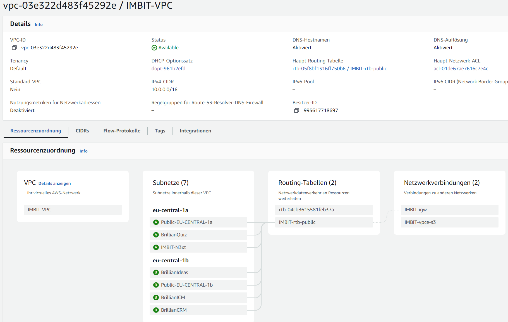
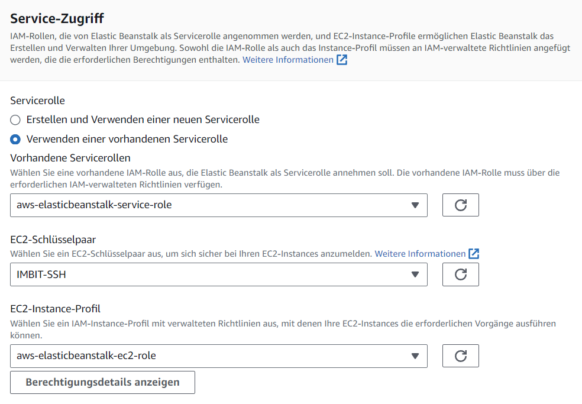
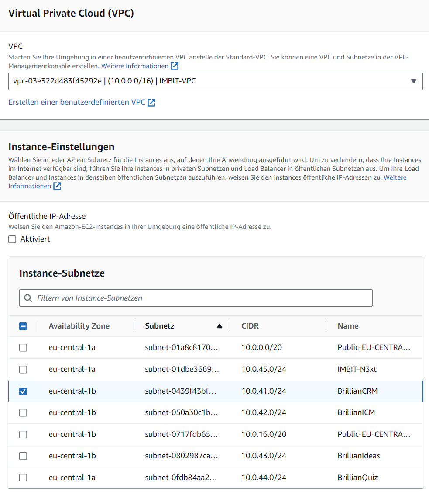
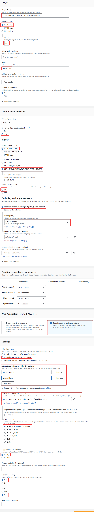

Amazon Web Services (AWS) can present a steep learning curve to newcomers; it's not structured around a centralized dashboard, so users require a grasp of specific AWS jargon and an understanding of how services are regionally distributed to effectively manage their configurations. This documentation aims to demystify the IMBIT AWS infrastructure by providing a detailed walkthrough.

## Each AWS Service
- **Elastic Beanstalk**: A PaaS platform for deploying web applications developed for example with Docker.
- **Amazon EC2 (Elastic Compute Cloud)**: A service that provides IaaS computing, allowing to run and manage server instances.
- **Amazon VPC (Virtual Private Cloud)**: A service that provides networking within AWS.
- **Route 53**: The Domain Name System (DNS) for managing and registering domains.
- **Amazon CloudFront**: A content delivery network (CDN) service that securely delivers data globally with reverse proxy capabilities.
- **AWS ACM (Certificate Manager)**: A service that lets you easily create SSL/TLS certificates.
- **Amazon WorkMail**: Prodiving Mailbox functionality.
- **Amazon SES (Simple Email Service)**: A cloud-based email sending service.
- **Amazon IAM (Identity and Access Management)**: A service that enables you to manage user account access to AWS services.

## Regions
AWS resources are hosted across different geographical regions. As of 2024, IMBIT utilizes the following regional structure:

| Location           | Region Code        | Note                                                              |
|--------------------|--------------------|-------------------------------------------------------------------|
| **Frankfurt**      | eu-central-1       | The primary hosting location.                   |
| **Ireland**        | eu-west-1          | For WorkMail and Amazon SES (region requiered by AWS). |
| **North Virginia** | us-east-1          | For CloudFront and Certificate Manager (region requiered by AWS).                  |
| **Global**         | N/A                | Route 53 and IAM are not bound by regional constraints and operate globally. |

## Domains and DNS Settings
Managing domains and DNS settings involves:

- **Registration and Renewal**: Domains are registered and renewed directly through AWS and can be managed in Route 53.
- **DNS Setup**: DNS entries include a 'www' CNAME record that points to the root domain's A record, NS and SOA records pointing to AWS, and specific CNAMES for ACM validation. The A record links to the CloudFront alias URL.
- **Email-Configured Domain**: 'brillianideas.com' is configured with MX records for mail routing, SPF records for sender policy, DMARC for domain-based message authentication, and DKIM for email security, using CNAME records for DKIM verification. All domains are correctly set up with the exception of 'digital-learning-imbit.com.'

Route 53 DNS settings for brillianideas.com

## Networking Setup (in VPC Dashboard)
The VPC for IMBIT features:

- A default IP range (10.0.0.0/16).
- Private subnets for each application, starting at 10.0.41.0/24.
- Public subnets (10.0.0.0/20 and 10.0.16.0/20) for allowing external access.

IMBIT-VPC Oerview

## Email Infrastructure Using AWS WorkMail and SES

### AWS WorkMail Configuration (IRELAND!)

To utilize AWS WorkMail for the BrillianIdeas domain (@mail.brillianideas.com), an organization is first established within WorkMail. Currently, there exists a single user: `no-reply@mail.brillianideas.com`. The credentials for this user are securely stored in Bitwarden.

It is essential to maintain a single organization within WorkMail to avoid unnecessary billing. WorkMail charges per user, per month, so it is cost-effective to consolidate users under one organization where possible.

### AWS Simple Email Service (SES) Configuration (IRELAND!)

BrillanIdeas leverages AWS SES to handle the receiving and sending of emails. To successfully send emails, the domain and the mailbox user need to be verified, which involves DNS record configuration (automatic DNS settings via the AWS UI) and mailbox verification through a confirmation email link.

Emails are dispatched from the subdomain `mail.brillianideas.com`. Despite a non-alignment error, "Mail From Datensatz ist nicht ausgerichtet," this can be safely disregarded. Domain-based Message Authentication, Reporting & Conformance (DMARC) records are set up for this subdomain to authenticate outbound emails, enhancing security and delivery success and the domain keys identified mail (DKIM) settings are modern and secure, utilizing 2048-bit encryption keys and managed via CNAMES automatically by AWS.

To assess the spam rating of sent emails you can use https://mail-tester.com. For testing purposes, one might input the target email address displayed on https://mail-tester.com [into the BrillianCRM registration or similar forms. As in the time of writing the Quiz Application receives a 10 and CRM/ICM receive a 8.5 spam rating (the only issue being the short messages).

### Email Receiving Configuration

For receiving emails, two AWS SES rulesets are necessary: 

1. **Receipt Rulesets (Empfangsregelsätze):** These define the conditions for receiving emails, such as the destination domain (brillianideas.com), and the action to take, which involves directing the email to the relevant WorkMail organization Amazon Resource Name (ARN).
   
2. **IP Address Filter:** This is currently set to accept all connections (0.0.0.0/0), allowing unrestricted receipt of emails from any IP address.

### SMTP User and Credentials

For the sending of emails, an identity (SMTP user) is created in AWS Identity and Access Management (IAM). The SMTP user's credentials are stored in Bitwarden, with the SMTP settings usually configured as follows:

- **Port**: 587
- **Server**: email-smtp.eu-west-1.amazonaws.com
- **Protocol**: tls

To sign in to AWS WorkMail and access the mailbox, you can use the following link: [https://brillianideas.awsapps.com/mail](https://brillianideas.awsapps.com/mail).

## Identity and Access Management (IAM)

Two key identities configured within IAM:

1. **Mail Sending User:** This identity is specifically created for the purpose of sending emails via AWS SES.

2. **GitHub Workflow User:** This user is designated for deploying applications. The user has restricted permissions, limited to `AdministratorAccess-AWSElasticBeanstalk` only. The credentials for this user are hardcoded within the GitHub workflow for automation purposes.

## Elastic Beanstalk for Application Deployment

The majority of the applications are deployed using Elastic Beanstalk. First an application is created and then inside of it an environment needs to be created which are configured as follows:

1. **Application Domain:** The Elastic Beanstalk environment URL is set to the application's name (e.g., `applicationname.eu-central-1.elasticbeanstalk.com`). This domain is necessary for future integration with AWS CloudFront. The platform is set to Docker, and the initial deployment can be done using a sample application, as the actual code will be uploaded via GitHub. After the deployment with the sample code, it is also possible to upload a `docker-compose.yml` file directly through the GUI.

2. **Service Roles and EC2 Key Pairs:** Provisioning includes selecting the appropriate service roles such as `aws-elasticbeanstalk-service-role`, picking the SSH Key `IMBIT-SSH` and the EC2 instance profile (`aws-elasticbeanstalk-ec2-role`).

3. **Virtual Private Cloud (VPC) Settings:** The IMBIT-VPC is selected, without assigning a public IP, but ensuring the proper subnet is chosen. Each application receives their own subnet in order for proper security! No associated databases are configured.

4. **Storage and Security:** Default volume settings are applied, and the `IMBIT-SecurityGroup` is added. At this stage, no scaling is configured. In terms of architecture, `arm64` may be chosen for cost efficiency, but compatibility with the code base should be verified (only the `brillianideas` application is known to work with `arm64`). For `arm64`, the instance type is `t4g`, and for `amd64`, the instance type is `t3.micro`.

Health reporting is set to basic, and automatic updates are disabled as it crashed in the past. However, it may be worthwhile to re-evaluate and test automatic updates in the future.

Once configured, the application will be accessible via its Elastic Beanstalk URL and can be updated through the GitHub workflow.

## CloudFront as a Reverse Proxy

AWS CloudFront acts as a reverse proxy and one deployment is needed per Beanstalk application.

- **Origin Domain**: The Origin Domain for the CloudFront distribution is configured using the Elastic Beanstalk application URL, which typically takes the form `https://applicationname.eu-central-1.elasticbeanstalk.com`. It is also important to set the protocol to HTTP only with port 80 as the applications have only that port/protocol open. 

- **Origin Path**: This is left empty.

- **Origin Name**: The Origin Name is given the name of the application.

- **HTTP Methods**: By default, the CloudFront distribution is set to allow standard HTTP methods (GET and HEAD). However, for most applications requiere additional methods such as POST, PATCH, and DELETE.

- **Cache Policy**: For the Cache policy `CachingDisabled` is picked as otherwise it takes some time for changes to go live.

- **Web Application Firewall (WAF)**: WAF is not used due to additional costs.

- **Geographic Restrictions**: The distribution is restricted to North America and Europe to optimize for reducing costs.

- **SSL/TLS Configuration**: CloudFront automatically serves HTTPS and redirects from HTTP.

- **Alternative Domain Names**: To enable CloudFront to respond to requests for custom domains, such as `brilliancrm.com`, alternative domain names need to be entered, and the custom domain SSL certificates need to be picked. The certificates can be requested in ACM (Certificate Manager).

- **Certificate Manager Integration**: When setting up or renewing SSL certificates with AWS ACM, the domain name and its 'www' subdomain are included in the request. Validation is performed using CNAME records, which can be automatically created in Route 53 if the domain is managed there.

- **Distribution Deployment**: After the configuration settings are in place, the CloudFront distribution is deployed. Once deployed, it takes some time for the changes to propagate across the network of edge locations.

- **CloudFront and Route 53 Integration**: Once the CloudFront distribution is created and active, the CloudFront domain name is entered into Route 53 as an alias record, which connects the custom domain to the CloudFront distribution, completing the setup process.

## Elastic Compute Cloud (EC2)

An EC2 instance (VM) is automatically created when creating a Elastic Beanstalk application/environment.

### Key Pair and Instance Access

Each EC2 instance can be accessed using an SSH key, which is managed within the EC2 dashboard. Access to the instance's shell is provided through the AWS UI by clicking on the required instance. However, as deployments are handled as Platform as a Service (PaaS) through AWS Elastic Beanstalk, direct access to EC2 instances is generally not needed.

### Security Groups and Instance Configuration

Security groups act as virtual firewalls, controlling the traffic allowed to and from EC2 instances. Modifying a security group's rules may necessitate creating a new EC2 instance to reflect the changes. Each Beanstalk application automatically generates a security group with the suffix `-env`. Additionally, all applications are part of the `IMBIT-SecurityGroup`, which permits any to any HTTP and HTTPS traffic on both IPv4 and IPv6. To allow external SSH access, it must be enabled within this security group.

### EC2 Volumes and Auto Scaling

The storage volumes for EC2 instances are automatically provisioned when setting up an Elastic Beanstalk application, with default configurations of 8GB, 100 IOPS, and General Purpose SSD (gp2). Auto scaling groups, which automatically adjust the number of EC2 instances to meet demand, are also created automatically to set to only launch a single instance.

## CI/CD GitHub Workflow Pipeline

Each application employs a GitHub Workflow defined in the `.github/workflows/deploy-AWS.yml` file of each repository. This workflow automates the deployment process, building Docker images using the repository's Dockerfile(s) and pushing them to the GitHub image registry and then to their specified Elastic Beanstalk environment upon commits to the main branch. It's essential to ensure that the GitHub repository for the Docker image is set to public, as the default setting will be set to private for new packages and repositories. The setting can be changed in GitHub once a package has been released. Additionally ensure that the application and environment name defined in the `deploy-AWS.yml` matches the one defined for the Elastic Beanstalk environment!

## Data Backup Strategy

As the code and complete configuration for almost each application resides within their respective GitHub repository, there is currently no a formal backup strategy. Registered user accounts for services BrillianQuiz, BrillianCRM, and BrillianICM are the only valuable data; however users can re-register in the event of a total loss. The sole exception is the WordPress page, which would require a different approach to data backup and restoration.

## Preventing Data Loss and Handling EC2 Shutdowns

If there is a need to terminate an application, it should be done through the Elastic Beanstalk dashboard. The application will initially show as terminated and will automatically disappear after a certain period. It is essential to handle the shutdown of EC2 instances with care, as their associated volumes will be deleted!

